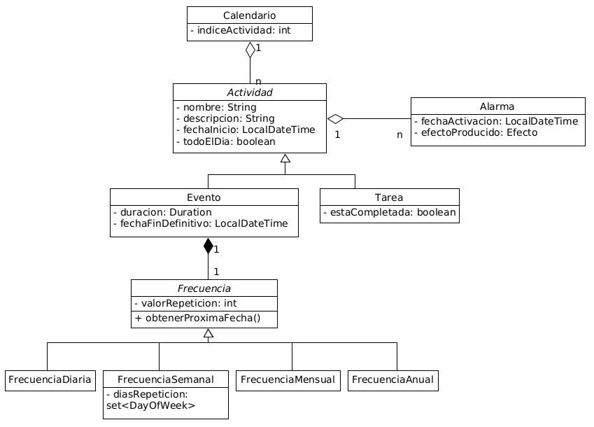
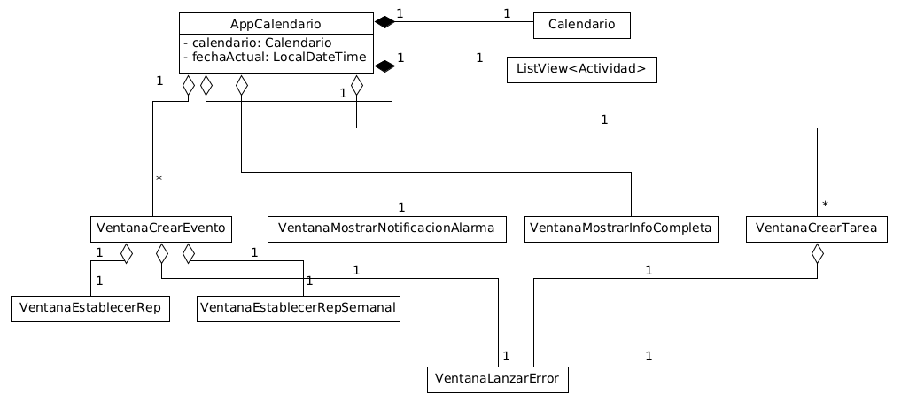
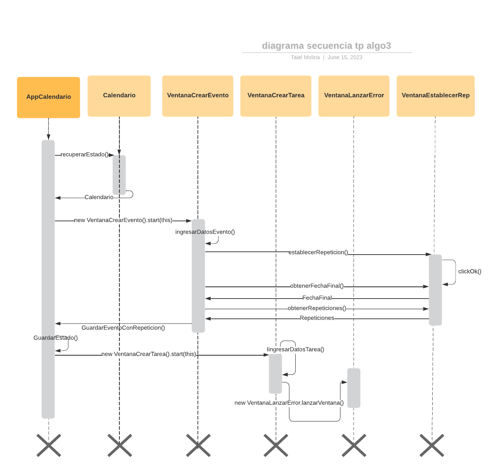

# TP-Algo3

This project is a practical work of the whole subject of Algorithms and Programming III, course Corsi-Essaya, of the University of Buenos Aires. The subject is about Object-Oriented programming in almost whole the time. The idea of the work is to make a calendar similar to Google Calendar.

I never work in this after approves it because I see more useful watch what I can do in the middle of being learning the paradigm and studying this and more subjects.

I leave below the report I made in a .MD format too.

---

Integrantes
  
Kriger, Lucas. Padrón: 109344

Molina, Taiel. Padrón: 109458

## Informe

### Diseño

Para el modelado del tp lo primero que buscamos es agrupar aquellos elementos que comparten cosas en común en clases madres abstractas, y luego en las clases hijas que sí son instanciables, ser más específico acerca de las características (métodos y atributos) del objeto. Esto se ve reflejado en las clases de Actividad y Frecuencia. Luego con la clase Calendario quisimos simplificar los comandos, ocultando ciertos manejos para hacer más amena la interación del usuario.

A nivel GUI la idea fue hacerla bastante similar a lo que es Google Calendar, con las obvias limitaciones que impone el tiempo y dandole un toque personal y uniforme a todas las ventanas que pertenecen a la misma. 

### Responsabilidades de las clases principales

- Actividad

Almacena el ID, nombre, descripcion, fecha de inicio, si es o no una actividad de todo el día y las alarmas de una actividad. Tiene sus getters y setters correspondientes a estos atributos mencionados.

- Tarea

Extiende Actividad, almacena además el estado de una tarea y tiene su getter y setter correspondiente a este.

- Evento

Extiende Actividad, almacena la fecha de fin del evento (el fin de las repeticiones), la duracion del evento y la frecuencia con la que se repite el evento.

- Alarma

Representa una alarma de una actividad, almacena la fecha en la que suena y el efecto que se desea que produzca. Dada una fecha puede decir cuanto tiempo falta para que suene.

- Frecuencia

Representa cada cuanto tiempo se repite un evento, existiendo 4 subclases que la extienden que indican de que tipo es la frecuencia: diaria, semanal, mensual y anual. Dada dos fechas puede indicar todas las repeticiones que hay de un evento.

- Calendario

Almacena una colección de actividades. 

    - Dada dos fechas puede indicar cual es la siguiente alarma existente en ese lapso de tiempo. 
    - Puede guardar y recuperar su estado.
    - Proporciona una fachada para los getters y setters de todas las actividades pertenecientes al mismo.
    
- VistaActividad

Dada una actividad se encarga de almacenar el color que mostrará la GUI para representarla, y setea la información resumida y la información completa que mostrará la GUI en el momento adecuado.

- AppCalendario

Es la GUI de la clase Calendario. Muestra en pantalla las actividades que hay en el lapso pertinente (mes, semana, día). Cada vez que se quiere crear una actividad nueva, lanza una ventana correspondiente para crear la actividad correspondiente, que a su vez cada ventana puede lanzar otras ventanas para ingresar algunos datos específicos, o para mostrar que hubo un error ingresando alguno.

### Patrones de diseño utilizados

- Prototype

Lo utilizan los eventos al momento de devolver las repeticiones del mismo en el método actividadesEntreFechas, en el cual además se hace un prototype de las alarmas
correspondientes a la actividad original, y se agregan sus clones, con las fechas de activación ajustadas, al evento clon.

- Facade

La clase Calendario es una fachada la cual muestra una interfaz más sencilla para el usuario al momento de crear Eventos y Tareas.

- Visitor

Hay dos visitor utilizados en el tp. El primero se utiliza para obtener las vistas de las actividades (vistaEvento y vistaTarea). El segundo se utiliza para obtener
la frecuencia de un evento, si es que la tiene.

- Observer

Se utiliza en la GUI para desde stages distintos al stage principal mandar mensajes al Calendario. Se ve en las ventanas de crear nuevas actividades, que reciben una interfaz de guardado para que una vez se valida que los datos ingresados para crear la actividad son válidos, se envía el mensaje para que se cree y se agregue la nueva actividad, además de luego realizar un nuevo guardado del estado actual del calendario.

### Diagrama de clases

Diagrama UML de la lógica:

Diagrama UML de la GUI:

Diagrama de secuencia:

